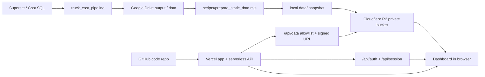

# Truck Cost Dashboard - Project Overview

Last reviewed: 2026-06-20

## Current Status

| Area | Value |
|---|---|
| Production app | https://truck-cost-dashboard.vercel.app |
| GitHub repo | https://github.com/nhd712193-star/truck-cost-dashboard |
| Git branch | `main` |
| Data access | Vercel `/api/data/*` -> private R2 signed URL |
| R2 bucket | `b2b-truck-cost-dashboard` |
| R2 prefix | `prod` |
| Local dashboard root | `/Users/nguyendung/Documents/Mở rộng B2B/truck_cost_dashboard` |
| Local pipeline output | `/Users/nguyendung/Documents/Mở rộng B2B/truck_cost_pipeline/drive_output/data` |

## Business Scope

Dashboard theo dõi chi phí Truck Last-mile cho nhóm đơn hàng nặng:

- Chỉ lấy đơn có `weight >= 15000` gram.
- Chỉ lấy `cost_type` thuộc `DELIVER` và `RETURN`.
- `PICK` chưa nằm trong phạm vi hiện tại.
- `total_cost` là chi phí chính.
- `cost_date` là ngày từ bảng cost raw, không phải ngày giao booking.

## Production Architecture



## Runtime File Layout

Vercel cần frontend, serverless API và private templates:

```text
index.html          # login-only fallback
app.js
login.js
styles.css
api/
  auth.js
  data.js
  page.js
  session.js
  _templates/
    dashboard.html
    login.html
assets/
config/
docs/
scripts/
vercel.json
README.md
```

Thư mục `data/` không commit lên GitHub. Đây là snapshot local để test và upload
lên R2.

## Production Data Layout

R2 lưu data private tại:

```text
prod/manifest.json
prod/rollups/daily.csv.gz
prod/rollups/province.csv.gz
prod/rollups/ward.csv.gz
prod/rollups/order_index/month=YYYY-MM.csv.gz
```

`order_index` được chia theo tháng để dashboard không phải tải một file lớn khi
mở trang. Dashboard gọi `/api/data/...`; API kiểm session/quyền và chỉ ký các
path nằm trong allowlist.

## Secrets

Credential Cloudflare R2 nằm local ở:

```text
/Users/nguyendung/Documents/Mở rộng B2B/truck_cost_dashboard/.env.r2
```

File này bị ignore bởi Git và không được commit. Không paste token hoặc secret
vào chat/log công khai. Nếu credential đã từng bị chia sẻ ngoài máy local, nên
rotate token trong Cloudflare rồi cập nhật lại `.env.r2`.
